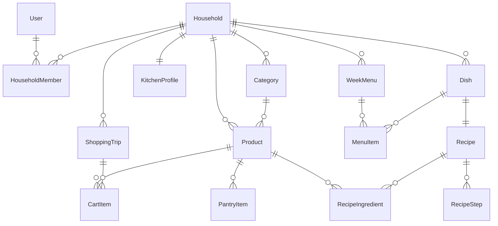
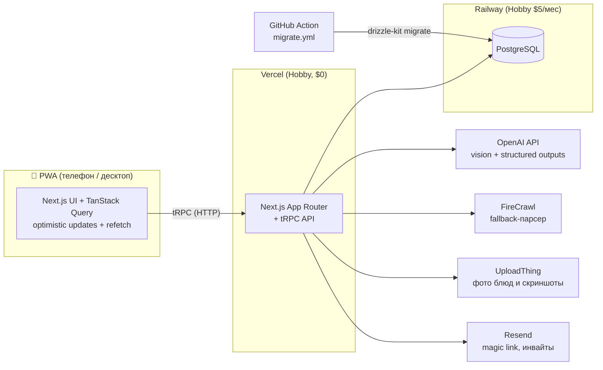

# Larder — Vision

> **Larder** (англ. «кладовая») — общий продовольственный хаб домохозяйства.
> Планируем блюда на неделю → корзина собирается сама → покупаем вместе → купленное оседает в кладовой → готовим по своим рецептам в едином формате → повторяем.

Open source (MIT). Mobile-first веб-приложение (PWA), полноценно работающее и на десктопе. Следующий шаг после обкатки — iOS-приложение на React Native.

---

## 1. Проблема

Сегодня весь процесс живёт в общей заметке iPhone, и она трещит по швам:

- **Дубли продуктов.** Список большой; «помидоры» есть внизу как купленные и одновременно вверху как новые — потому что заметка не знает, что это один и тот же продукт.
- **Идентификация продуктов.** Эмодзи проставляются вручную, и не для всего они существуют. Количество указывается от случая к случаю.
- **Рецепты разбросаны.** Блюда — списком в заметке, рецепты — в закладках браузера на разных сайтах, а чаще — на скриншотах из Instagram и картинках-карточках. Единого места и единого формата нет.
- **Порционность и техника не учитываются.** Рецепты с сайтов рассчитаны на чужие порции и чужую кухню («взбейте миксером» — а миксера нет).
- **Нет настоящего realtime.** В магазине приходится ждать обновления заметки, чтобы увидеть, что второй уже взял или заказал.

## 2. Принципы

1. **Каждый модуль полезен сам по себе.** Корзиной можно пользоваться с первого дня, не заведя ни одного рецепта. Переезд с заметок — за один вечер.
2. **ИИ — помощник, не хозяин.** Всё, что сделал ИИ (распарсил, подобрал, посчитал), всегда можно отредактировать руками. Ручное добавление — полноценный равноправный путь.
3. **Сохраняем сразу, показываем при обновлении (MVP).** Каждое действие персистится немедленно — «несохранённых правок» не существует; у партнёра изменения подъезжают при открытии/возврате к экрану, по кнопке «Обновить» (pull-to-refresh) и мягким фоновым поллингом. Одновременное редактирование одного и того же поля разрешается по last-write-wins (см. 6.3) — для домохозяйства из двух человек это осознанный компромисс, а не скрытый сюрприз. Мгновенный realtime — вынесен в пост-MVP (решение 2026-08-19: приложение живёт на Vercel/serverless).
4. **Mobile-first.** Главный сценарий: телефон в одной руке, тележка — в другой. Большие тач-таргеты, оптимистичный UI, устойчивость к плохой связи у касс.
5. **Свои данные.** Open source, self-hosting через переменные окружения, экспорт данных.

## 3. Модули

### 3.1 Корзина (общий список покупок)

- Общий список домохозяйства. Видно, **кто добавил** и **кто купил/заказал**. Изменения партнёра подтягиваются при открытии/фокусе экрана, по «Обновить» и фоновым поллингом, пока список открыт.
- Добавление только через **автокомплит по каталогу продуктов** домохозяйства → дубль физически не создаётся. Каталог стартует не пустым: в приложение зашит **предзаполненный справочник частых продуктов** (иконка, отдел, единица по умолчанию) — знакомые продукты подставляются мгновенно и бесплатно. Для нестандартного («буррата») иконку и отдел подбирает ИИ. Всё редактируемо, в том числе у уже существующих продуктов.
- У позиции: количество + единица (шт / кг / г / л / упаковка), опциональная заметка («покрупнее»), опционально — **кто берёт** (у нас закупки разделены: овощи-фрукты, мясная закупка на выходных, доставка).
- **Статусы позиции:** `нужно` → `заказано` → `куплено`. «Заказано» — для доставки (Wolt Market, Carrefour): второй видит, что заказывать/покупать уже не надо. Когда заказ привезли — кнопка «Заказ получен» на группе заказанных (или обычный чекбокс) переводит их в «куплено», дальше они живут по общему правилу.
- **Инвариант «одна активная строка на продукт»** (закреплён уникальностью в БД): повторное добавление продукта, который уже в корзине, не создаёт дубль, а увеличивает количество существующей строки; если продукт уже отмечен купленным в текущей закупке — приложение предлагает вернуть его в «нужно». Исходная боль заметок («помидоры и вверху, и внизу») исключена по построению.
- **Группировка по отделам магазина** (овощи-фрукты → молочка → мясо → бакалея…), порядок отделов настраивается под свой маршрут по залу.
- Купленное зачёркивается и опускается вниз своей секции; кнопка **«Завершить закупку»** переносит **все** позиции со статусом «куплено» — чьи бы они ни были: закупка общая на household, а не на человека — в кладовую и в историю; `tripId` присваивается именно в этот момент. Позиции «нужно» и «заказано» остаются в корзине. Второй участник увидит завершение при следующем обновлении списка. История закупок (что и когда покупали) — побочный продукт этого действия, отдельной сложности не добавляет.
- **Оптимистичный UI:** чекбокс срабатывает мгновенно даже без связи, синхронизация догоняет в фоне; конфликты решаются по принципу «последний пишет».

### 3.2 Кладовая

Базовый учёт «что есть дома» — **наличие без количеств и сроков годности** (осознанное решение: полный учёт остатков требует дисциплины и такие системы забрасывают).

- Купленное попадает в кладовую в момент «Завершить закупку» (см. 3.1) — в список «дома есть», по тем же отделам.
- **«Кончилось» = один тап** → продукт улетает обратно в корзину. Кладовая — источник быстрых повторных покупок; это то, что сейчас делается вручную перетаскиванием строк в заметке.
- **Режим ревизии:** быстрый проход по кладовой свайпами («есть / кончилось»), чтобы изредка актуализировать её за минуту.
- При сборке корзины из меню недели ингредиенты **сверяются с кладовой**: что дома есть — помечается «уже есть» и по умолчанию не добавляется (можно переопределить).

### 3.3 Блюда и рецепты

- Библиотека блюд домохозяйства: фото, теги (ужин, быстро, духовка…), поиск.
- **Единый формат рецепта:** ингредиенты (связаны с каталогом продуктов + количество на базовое число порций), шаги (с опциональными таймерами), общее время, число порций, необходимая техника, источник (ссылка/фото).
- **Импорт — фото прежде всего** (наш главный реальный источник — скриншоты из Instagram и карточки-картинки): загружаешь фото → ИИ-vision распознаёт и раскладывает в единый формат → экран проверки, где всё можно поправить. Нераспознанные места ИИ честно помечает «уточнить» (например, «кукурузный крахмал — количество не указано»), а не выдумывает.
- Импорт по **ссылке**: каскад «JSON-LD → microdata → FireCrawl + ИИ» (см. 6.4). Импорт **текстом**: вставил — ИИ отформатировал. И всегда можно создать рецепт **вручную с нуля**.
- **Пересчёт порций:** ползунок порций пересчитывает количества ингредиентов.
- **«Ингредиенты в корзину»** прямо с карточки блюда — с тем же превью-диффом и сверкой с кладовой, что и при сборке из меню недели (см. 3.4).
- **Профиль кухни:** рецепт сверяется со списком нашей техники; если требуется то, чего нет («мультиварка», «миксер»), ИИ предлагает адаптацию под то, что есть.
- **Режим готовки:** крупные шаги на весь экран, шаг-за-шагом, встроенные таймеры, список ингредиентов под рукой, экран не гаснет.

### 3.4 Меню недели

- **Пул блюд на неделю** без привязки к дням (осознанное решение: гибкость важнее календарного давления; что захотелось сегодня — то и готовим). Поле «день недели» заложено в модель данных как опциональное — для фазы 2.
- У блюда в меню: число порций, отметка «приготовлено».
- Кнопка **«Собрать корзину»**: ингредиенты всех блюд меню сводятся вместе, сверяются с кладовой, показывается **превью-дифф** («добавим 8 позиций, 4 уже есть дома, 2 уже в корзине») → подтверждение → всё в корзине.
- **Правила слияния:** складываются только количества в совпадающих единицах (лук «2 шт» + «1 шт» = одна строка «лук — 3 шт»); при разных единицах («200 г» + «1 шт») и для позиций, уже лежащих в корзине, автослияния нет — они подсвечиваются в превью для решения руками. Кухонные единицы рецептов (ч.л., ст.л., плитка) нормализуются ИИ в покупочные ещё при импорте рецепта, а не изобретаются на этапе сборки.
- История меню прошлых недель и действие «повторить неделю» — быстрый способ воспроизвести удачную неделю (входит в MVP: сущность WeekMenu и так хранит недели).

### 3.5 ИИ-ассистент

Чат + быстрые действия. Ассистент работает через инструменты (function calling) над нашими же данными:

- «Собери меню на неделю без повторов» (учитывая наши блюда, кладовую, технику).
- «Что приготовить из того, что в корзине/кладовой?»
- «Чем заменить сливки в этом рецепте?»
- Пересчёт и адаптация рецепта под порции и нашу технику.
- Любой результат ассистента — это **предложение**: применяется кнопкой, редактируется руками.

## 4. Сценарии из нашей жизни

**А. Начало недели.** Вечером выбираем в пул 4–5 блюд (или просим ассистента предложить). «Собрать корзину» → превью → корзина готова, разложена по отделам. Она берёт овощи-фрукты по своей секции; на выходных вместе берём мясо на 1–2 недели вперёд; остальное я заказываю в Wolt Market / Carrefour и отмечаю «заказано» — у неё в магазине это подъедет при следующем взгляде на список (обновление по фокусу или свайпу).

**Б. Рецепт со скриншота.** Ей понравился рецепт в Instagram → скриншот → «Импорт → Фото» → ИИ разложил в наш формат → она поправила пару количеств → блюдо в библиотеке, навсегда, с привязкой ингредиентов к каталогу.

**В. Готовка.** Открыли «NYC Cookies», выставили порции, «Режим готовки»: шаги по одному, таймер на 9–11 минут, критерии готовности перед глазами. Духовка есть в профиле кухни — рецепт уже адаптирован под неё.

**Г. «Что-то закончилось».** Заметили, что кончилось масло → открыли кладовую → тап — масло в корзине. Раз в пару недель — минутная ревизия свайпами.

## 5. Модель данных



Ключевые сущности:

| Сущность | Главные поля | Заметки |
|---|---|---|
| `Household` | name | MVP: у пользователя одно домохозяйство |
| `Invite` | token, expiresAt, usedAt | Одноразовые инвайт-ссылки с TTL |
| `Product` | name, icon (emoji), categoryId, defaultUnit, aliases[] | Каталог домохозяйства; aliases — для автокомплита и мёржа («помидор» = «помидоры») |
| `Category` | name, icon, sortOrder | Отделы магазина; порядок редактируется |
| `CartItem` | productId, qty, unit, status (`needed`/`ordered`/`bought`), note, addedBy, buyerId?, orderedVia?, tripId? | `orderedVia`: wolt / carrefour / другое. Активная позиция уникальна по productId (партишл-индекс `WHERE tripId IS NULL`) |
| `ShoppingTrip` | closedAt | «Завершить закупку» закрывает поездку, купленное → кладовая + история |
| `PantryItem` | productId, updatedAt | Только факт наличия, без количеств |
| `Dish` | title, photoUrl, tags[], sourceType (`photo`/`url`/`text`/`manual`), sourceUrl? | |
| `Recipe` | portionsBase, totalTimeMin, equipment[] | 1:1 с Dish |
| `RecipeIngredient` | productId?, rawText, qty?, unit?, needsReview | `needsReview` — флаг «уточнить» от парсера |
| `RecipeStep` | order, text, timerSec? | |
| `WeekMenu` / `MenuItem` | weekStart; dishId, portions, dayOfWeek? (null в MVP), cookedAt? | |
| `KitchenProfile` | householdSize, equipment[] | Чеклист техники + свободный ввод |
| `AiJob` | type (`parse_photo`/`parse_url`/`parse_text`/`assistant`), status, inputRef, outputJson, costUsd | Прогресс парсинга в UI + учёт расходов на OpenAI |

Наш профиль кухни на старте: духовка, микроволновка, чайник, индукционная плита, блендер, тёрка, чеснокодавилка. Нет: мультиварки, миксера, аэрогриля, комбайна — ассистент это учитывает.

## 6. Архитектура

### 6.1 Общая схема



Решение 2026-08-19: приложение живёт на **Vercel** (пользователь задеплоил, Hobby-тариф), БД — на **Railway**. Мгновенный realtime, под который изначально выбирался always-on процесс на Railway, вынесен в пост-MVP — синхронизация MVP построена на refetch (см. 6.3).

### 6.2 Стек и роли

| Слой | Выбор | Зачем |
|---|---|---|
| Хостинг | **Vercel** (приложение, Hobby) + **Railway** (Postgres) | Vercel — serverless: подходит для tRPC/страниц, но не для долгоживущих соединений ⇒ realtime вынесен в пост-MVP. Бюджет: Vercel $0; Railway Hobby $5/мес (включает $5 usage-кредита — Postgres в них укладывается) |
| Прод-миграции | **GitHub Action** `migrate.yml` (секрет `DATABASE_URL`) | Запускается при изменении `src/db/migrations/**` в main; деплой кода и миграция не атомарны ⇒ миграции только обратно совместимые (add-only) |
| Фреймворк | **Next.js (App Router)** | Веб + PWA; SSR для быстрого старта |
| БД / ORM | **PostgreSQL + Drizzle** | Лёгкий ORM, простые миграции, отличная пара с Better Auth |
| API | **tRPC** | Типобезопасность без кодогенерации; переиспользуется будущим RN-приложением (Server Actions в RN не взять) |
| Синхронизация (MVP) | **TanStack Query refetch**: on focus + фоновый интервал + pull-to-refresh | Изменения партнёра подъезжают за секунды при взгляде на экран; мгновенный push — пост-MVP (см. §7) |
| Клиент-состояние | **TanStack Query** | Оптимистичные мутации; инвалидация/refetch по фокусу, интервалу и вручную (6.3) |
| Auth | **Better Auth**: Google OAuth + magic link (Resend) | Вход в 2 тапа; инвайт в household по ссылке |
| ИИ | **OpenAI**: дешёвая модель (класс gpt-5-mini) для парсинга/vision/иконок; старшая — только для генерации меню в ассистенте | Бюджет: потолок $20/мес, ожидаемо $3–5 (см. 6.5) |
| Парсинг сайтов | Свой каскад + **FireCrawl** (fallback) | См. 6.4 |
| Файлы | **UploadThing** | Фото блюд, скриншоты рецептов |
| Email | **Resend** | Magic link, инвайты; позже — пятничное «пора спланировать меню» |
| Валидация | **Zod** — одна схема рецепта для форм, tRPC и structured outputs | Схема = контракт для людей и ИИ. Конвенция: опциональные поля через `.nullable()`, а не `.optional()` — требование strict-режима OpenAI |
| i18n | **next-intl**, базовый язык русский | Все строки в словаре с первого дня; EN добавится без переделки |
| Ошибки | Sentry (free tier), опционально | В магазине с телефона дебажить нечем |

Лимиты бесплатных тарифов (перепроверить при имплементации): FireCrawl — ~1000 кредитов/мес (нам хватит: он только fallback); UploadThing — 2 ГБ хранилища, поэтому фото **сжимаются на клиенте до ~300 КБ** перед загрузкой (бонус: дешевле vision-парсинг); Resend — 3000 писем/мес, ≤100/день, и **требует верифицированный собственный домен** (см. §8 — это пререквизит запуска).

### 6.3 Синхронизация и офлайн

Модель MVP (решение 2026-08-19): **сохраняем сразу, показываем при обновлении**.

- Каждое действие (чекбокс, добавление, статус) — обычная tRPC-мутация, сохраняется немедленно. Никакого «несохранённого черновика списка» — потерять правки невозможно.
- Изменения партнёра подъезжают через **refetch**: `refetchOnWindowFocus` (открыл телефон у полки — список свежий), мягкий фоновый интервал (~30–60 с, пока экран открыт), pull-to-refresh / кнопка «Обновить» для ручного «а ну-ка сейчас». После refetch изменившиеся строки мягко подсвечиваются.
- Мутации оптимистичны: чекбокс мгновенный, запрос уходит в фоне с ретраями (типичная ситуация — плохая связь у касс и в подвальных магазинах). Офлайн-очередь мутаций **персистится в IndexedDB** — Background Sync API на iOS отсутствует, а in-memory очередь теряется при выгрузке PWA; доставка происходит при открытом приложении по событию online. Мутации, досланные в уже закрытую закупку, попадают в текущую корзину по общим правилам слияния.
- Конфликты: last-write-wins на уровне позиции; для чекбоксов это безопасно.
- **Пост-MVP (мгновенный push)**: клиентский задел уже лежит в коде (`splitLink` с TODO-веткой под `httpSubscriptionLink`). Варианты реализации, когда дойдём: managed-канал (Pusher/Ably, дружит с serverless) либо возврат приложения на always-on хостинг с SSE + Postgres LISTEN/NOTIFY (выделенное соединение вне пула, reconnect ⇒ полная инвалидация кэша, несовместимость с PgBouncer transaction mode — заметки сохранены здесь именно на этот случай).

### 6.4 Пайплайн импорта рецептов

Приоритет №1 — **фото** (скриншоты Instagram, карточки-картинки): это основной реальный источник.

```
Фото/скриншот ──► UploadThing ──► OpenAI vision + structured output (Zod-схема Recipe) ──► экран проверки
Ссылка ──► fetch ──► есть JSON-LD Recipe? ──► да: берём бесплатно, ИИ только нормализует количества
                     └─ нет ──► есть microdata Recipe? ──► да: парсим бесплатно
                                └─ нет ──► FireCrawl (markdown) ──► ИИ-нормализация
Текст ──► ИИ-нормализация (та же Zod-схема)
Instagram-ссылка ──► пробуем FireCrawl; не пробилось ──► сразу предлагаем путь «фото/текст» (без тупика)
```

Каскад либерален к реальности: JSON-LD в дикой природе грязный (`@graph`-обёртки, массивы вместо объектов, `HowToSection`) — парсер терпимый, а лёгкая ИИ-нормализация количеств нужна и на «бесплатном» пути (копейки); прямой fetch с серверного IP часть сайтов режет ботозащитой — тогда штатно падаем в FireCrawl; Instagram-ссылку FireCrawl почти никогда не пробьёт (login wall) — для инсты основной путь именно скриншот.

Проверено на реальных ссылках из наших закладок (2026-08-08):

| Сайт | Что отдаёт | Путь парсинга | Стоимость |
|---|---|---|---|
| eda.rambler.ru | Полный JSON-LD Recipe (ингредиенты, шаги, порции) | Напрямую | ~$0 |
| povar.ru | Microdata schema.org/Recipe | Микродата-парсер | ~$0 |
| russianfood.com | Ничего структурированного | FireCrawl → ИИ | ~$0.01 |

Правила честности парсера: не выдумывать количества — нераспознанное помечается `needsReview` («уточнить») и подсвечивается на экране проверки; ингредиенты сопоставляются с каталогом продуктов (fuzzy-match по aliases), несопоставленные создаются как новые продукты после подтверждения.

### 6.5 Бюджет на ИИ (потолок $20/мес)

| Операция | Модель | Оценка стоимости |
|---|---|---|
| Парсинг фото рецепта | mini-класс, vision | ~$0.005–0.01 / шт |
| Нормализация текста/HTML | mini-класс | ~$0.002–0.005 / шт |
| Иконка+категория нового продукта | mini-класс | <$0.001 / шт |
| Ассистент (диалог) | mini-класс | ~$0.005–0.02 / запрос |
| Генерация меню недели | старшая модель | ~$0.03–0.05 / шт |

Парсинг зовём с `reasoning_effort: minimal/low` — иначе невидимые reasoning-токены (тарифицируются как output) раздуют копеечную операцию в 2–4 раза. Реалистичный месяц (20 импортов, 100 сообщений ассистенту, 4 меню): **$1–3**. Защита: учёт стоимости в `AiJob.costUsd`, мягкий лимит в настройках, при достижении — ассистент отключается до конца месяца (импорт остаётся: он дешёвый и важный).

### 6.6 PWA и ограничения iOS

- Manifest + иконки + standalone-режим: добавляется на домашний экран, выглядит как приложение.
- Ограничения iOS Safari честно принимаем: пуш-уведомления в PWA на iOS капризны — в MVP уведомлений нет (realtime внутри открытого приложения + email через Resend). Полноценные пуши — аргумент для RN-фазы.
- Wake Lock (экран не гаснет в режиме готовки) — в standalone-PWA на iOS работает только с **iOS 18.4+** (в обычной вкладке Safari — с 16.4). Fallback: приём NoSleep.js (зацикленное беззвучное видео) либо честная подсказка «не блокируй экран».

### 6.7 Безопасность и open source

- Все данные изолированы по household; каждый tRPC-запрос проверяет членство.
- Инвайт-ссылки одноразовые/с TTL (сущность `Invite`). Rate limit на ИИ-эндпоинты.
- Auth-таблицы Better Auth генерируются CLI (`@better-auth/cli generate`) и версионируются в общем пайплайне миграций Drizzle.
- Прод-миграции применяет только GitHub Action `migrate.yml` (секрет `DATABASE_URL` в GitHub). Локальный `.env` держит **только** localhost-URL: drizzle-kit сам подгружает `.env` встроенным dotenv, и прод-URL там был бы заряженным футганом. Закомментированная строка `# PROD_DATABASE_URL=` в `.env` — просто заметка, её никто не читает; осознанная прод-операция передаёт URL инлайном: `DATABASE_URL="<prod-url>" pnpm db:migrate` (shell-окружение бьёт env-файлы).
- MIT-лицензия; все провайдеры (OpenAI, FireCrawl, UploadThing, Resend) — через env-переменные, self-hosting дружелюбен. README на английском, UI на русском (i18n).

## 7. Фазы

**MVP (фаза 1):**
- Auth (Google + magic link), household + инвайт по ссылке
- Корзина: каталог, автокомплит, отделы + настраиваемый порядок, статусы (нужно/заказано/куплено), «кто берёт», синхронизация refetch-моделью (6.3), оптимистичный UI, «завершить закупку», история
- Кладовая: наличие, «кончилось → в корзину», ревизия свайпами
- Блюда: библиотека, единый формат рецепта, импорт фото/ссылка/текст/вручную, экран проверки, пересчёт порций, режим готовки
- Меню недели: пул, «собрать корзину» с превью-диффом и сверкой с кладовой; история недель и «повторить неделю»
- Ассистент: чат + 4–5 инструментов (меню, «что приготовить», замены, адаптация)
- Профиль кухни, i18n-каркас (ru), PWA

**Фаза 1.5 (быстрые продолжения):**
- Пятничное письмо «пора спланировать меню» (Resend) — идея, обсудим отдельно
- Sentry, экспорт данных

**Фаза 2:**
- **Мгновенный realtime** (managed-канал Pusher/Ably или возврат на always-on хостинг с SSE + LISTEN/NOTIFY — см. 6.3)
- Шаринг блюд/меню между домохозяйствами (публичные подборки — идея, обсудим)
- Опциональная привязка блюд к дням недели
- EN-локаль
- Полный учёт остатков — только если базовая кладовая приживётся и захочется большего

**Фаза 3:**
- React Native iOS-приложение поверх того же tRPC API (пуши, виджеты, Siri Shortcuts)

## 8. Название

**Larder** — англ. «кладовая». Коротко, по делу, отлично ложится на эстетику дизайн-системы Paper Ledger (Larder / Ledger — почти рифма). Кандидаты домена: `getlarder.app`, `larder.family`, `uselarder.com` (larder.io занят сервисом закладок); репозиторий — `larder` или `larder-app`.

**Важно:** домен — пререквизит запуска, а не отложенный вопрос: Resend требует верифицированный собственный домен для отправки писем (magic link, инвайты) на произвольные адреса.

## 9. Критерий успеха

Через месяц после запуска мы **не открываем заметки**: каждая неделя планируется и закупается в Larder, и оба считают, что так удобнее. Всё остальное — вторично.
